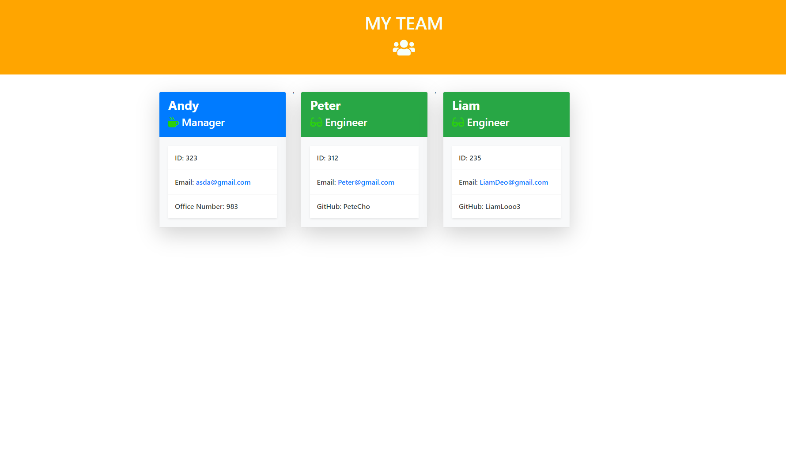

# Team-Generator

Command line app that generates an HTML with employee names, emails, id numbers ect.

**Instructions:**

    1. Run your terminal with the correct path
    3. In the terminal, run the command: npm install
    4. Run the command: node app.js
    5. Go through the prompts and complete.

